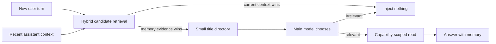

# QuietRecall

> An opinionated, local-first memory layer for long-running AI conversations.

QuietRecall is a reference implementation for people who prefer a small,
human-curated memory tree over automatic ingestion of every chat transcript.
It keeps Markdown as the source of truth, exposes only a tiny directory to the
model, and opens full text through short-lived capabilities when the model
actually needs it.

This repository contains only fictional example memories. It does **not**
contain the private corpus from which the design was developed.

## Why this exists

Long-term conversational memory has two failure modes that are equally
annoying:

1. the assistant fails to recall something that matters;
2. an irrelevant memory intrudes into an otherwise coherent conversation.

QuietRecall treats retrieval as progressive disclosure rather than automatic
top-k injection:



The current assistant context competes with long-term memories in the same
reranker batch. If the ongoing conversation explains the turn better, the
ordinary directory is suppressed. Explicit recollection requests bypass that
suppression and may expose a small vault catalog.

## Problems beyond search

A transcript search engine is a useful archive, but finding a relevant old
sentence is not the same as recovering the state of an evolving memory.
QuietRecall is designed around several failures observed in real, long-running
conversations:

| Pain point | Naive retrieval failure | QuietRecall response |
| --- | --- | --- |
| A plan later changed or failed | The early plan can rank above the final outcome | Curate the full arc into one leaf, state the current outcome near the top, and retain dated history below it |
| One event was discussed many times | Search returns one locally similar fragment and misses the rest | Consolidate related stages into one durable node; retrieve that node as a unit rather than treating every mention as a separate memory |
| A common word belongs to many memories | Flat top-k retrieval lets weakly related memories crowd the prompt | Let leaves compete inside an explicit hierarchy, give broad memories narrow authored surfaces, and cap the metadata directory |
| The current conversation already explains the message | Old memories interrupt a coherent discussion | Rank recent assistant context as a competing candidate and suppress the ordinary directory when context wins |
| A sensitive topic is mentioned casually | Topic matching opens private history without a recollection request | Keep sensitive scopes behind an explicit-recollection gate and a separate capability-scoped search |
| Canonical text changed after indexing | A stale derived index presents old content as current | Bind reads to the indexed content hash and refuse stale content until derived state is rebuilt |

The first two responses are intentionally a **curation contract**, not a claim
of automatic temporal reasoning. A human or maintenance agent decides that
several mentions belong to one memory and records both the current state and
the history that produced it. A raw transcript index remains a useful fallback
for evidence and forgotten details; it is complementary to this layer rather
than a substitute for it.

## Design choices

- **Curated Markdown is canonical.** SQLite indexes, vectors, segment stores,
  handles, and diagnostics are disposable derived state.
- **Parents explain; leaves compete.** Navigation files provide hierarchy and
  context but do not consume retrieval slots.
- **Metadata first, content second.** A turn receives at most 200 estimated
  tokens of memory metadata by default; full text is fetched only after a read.
- **Context can beat memory.** The tail of the latest assistant message is a
  competitor, reducing needless recall during a focused conversation.
- **Broad summaries can have narrow surfaces.** `strict_surface` memories keep
  their full body for reading but enter retrieval only through authored cues.
- **Sensitive scopes fail closed.** Private health and other vaults require an
  explicit recollection request plus a uniquely routed scope.
- **Reads are capabilities, not paths.** Opaque handles are random,
  turn-scoped, short-lived, single-use, scope-checked, and bound to the indexed
  content hash.
- **The service is local and fail-open for chat.** If memory is unavailable,
  the host conversation continues without injected context.

## What this is not

- not an automatic life logger;
- not a drop-in replacement for a vector database;
- not a claim that one memory taxonomy fits everyone;
- not a hardened multi-user secret store;
- not a benchmark result packaged as a product guarantee.

The repository is intentionally opinionated. It is most useful as a reference
for building a personal system with explicit structure and maintenance.

## Quick start: fictional example

Python 3.11+ is recommended.

```powershell
git clone https://github.com/waddlesa/quiet-recall.git
cd quiet-recall
python -m venv .venv
.\.venv\Scripts\python.exe -m pip install -r requirements.txt
.\.venv\Scripts\python.exe -m app.cli check
.\.venv\Scripts\python.exe -m app.cli sync
.\.venv\Scripts\python.exe -m tools.v2_build_segments
.\.venv\Scripts\python.exe -m tools.v2_phase2_cli `
  "Do you remember the bookshop with the blue door?" --read-rank 1
```

The default configuration uses deterministic hash/keyword backends so the
architecture can be exercised without downloading model weights. These
backends are for smoke tests only and do not represent real retrieval quality.

## Use BGE for real retrieval

Install the optional dependencies:

```powershell
.\.venv\Scripts\python.exe -m pip install -r requirements-bge.txt
```

Download compatible local model snapshots and change `config/policies.yaml`:

```yaml
validation:
  require_runtime_models: true

models:
  backend: bge
  embedding_name: BAAI/bge-small-zh-v1.5
  embedding_path: models/bge-small-zh-v1.5
  reranker_path: models/bge-reranker-base
```

The model directories are ignored by Git. Rebuild the derived index after
changing embedding backends.

## Memory tree contract

The example corpus lives in `examples/memory/`. Replace the root in
`config/sources.yaml` with your own directory and register every Markdown leaf
under exactly one namespace.

```text
memory/
├── profile/
│   ├── index.md          # navigation only
│   └── preferences.md    # retrievable leaf
├── daily/
├── relationships/
├── assistant/
├── private/health/
└── oc/character/
```

A broad summary can opt into a narrow retrieval surface:

```yaml
---
retrieval:
  mode: strict_surface
  cues:
    - rainy-day reading ritual
    - jasmine tea before reading
---
```

Its body remains intact for a later read, but body-vector similarity alone
cannot admit it into the automatic directory.

## Resident service

Build the index and canonical segment sidecar first, then start the loopback
service:

```powershell
.\scripts\start_service.ps1
```

The service creates a bearer token under `state/v2/`, binds only to
`127.0.0.1`, and provides:

- `POST /v1/plan`
- `POST /v1/search`
- `POST /v1/read`
- `POST /v1/end-turn`
- `GET /health`

Install `requirements-mcp.txt` and run `python -m tools.mcp_server` to expose a
thin stdio MCP adapter. The adapter forwards requests only; retrieval, scope,
budget, and capability policy remain in the resident service.

`hooks/user_prompt_submit.py` is an optional Codex `UserPromptSubmit` adapter.
It understands the original Chinese mode markers `#研究` (suppress personal
recall) and `#日常` (restore normal recall). Adapt this small surface for other
hosts or languages rather than copying policy into every integration.

## Tests

```powershell
.\.venv\Scripts\python.exe -m unittest discover -s tests -v
```

The public tests use only the fictional corpus and deterministic backends. The
private deployment's real-chat prompts, reports, indexes, and memory content are
not part of this repository.

## Privacy notes

- Do not commit your memory corpus merely because it is Markdown.
- Do not commit `state/`, model weights, service tokens, transcripts, or logs.
- Keep the service on loopback.
- A capability handle can appear in a host transcript. Treat local processes
  that can read that transcript as trusted during the handle TTL.
- Vault routing is a safety-oriented, auditable lexical gate. It is not a proof
  that the underlying content is cryptographically isolated.

See [SECURITY.md](SECURITY.md) for the exact boundary.

## Project status

Experimental alpha. The architecture has been used in a real single-user
deployment, but the bundled repository is a sanitized reference build. Expect
to tune the memory taxonomy, cues, thresholds, and integration layer for your
own language and usage pattern.

## Authors and origin

**Created by [waddlesa](https://github.com/waddlesa), with GPT.**

waddlesa originated the project and leads its product and architecture
decisions. The memory tree, progressive global-to-local disclosure, privacy
boundaries, context-as-competitor idea, and real-conversation acceptance
criteria grew from her experiments and daily use.

GPT is the co-designer and primary implementation partner, translating those
requirements into architecture, code, tests, and documentation. QuietRecall is
the result of sustained human–AI collaboration rather than a claim that either
worked alone.

## License

[MIT](LICENSE)
